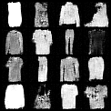
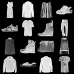

# Implementation-of-DDPM

## Repo structure
```
Implementation-of-DDPM/
    ├── models/
    │     └── unet.py
    |     └── diffusion.py
    |     └── __init__.py 
    ├── scripts/
    │     └── train.py
    |     └── sample.py
    ├── notebooks/
    │     └── ddpm_from_scratch.ipynb
    ├── checkpoints/
    │     ├── unet_diffusion_trained.pt
    │     ├── ...
    ├── app/
    │     └── app.py
    ├── README
    ├── gitignore
    └── requirements.txt
```
Model is deployed on streamlit : https://fashion-mnist-ddpm.streamlit.app/ (takes a bit more time)


## Training Dataset details 

- **Used dataset**: `FashionMNIST` from `torchvision.datasets`.
- **Description**: 28×28 grayscale images of clothing items (10 classes).

- **Switching datasets**: to use the original `MNIST`, replace `FashionMNIST` with `MNIST` in the data-loading cells.


## SAMPLED IMAGES (OUTPUT)
### Samples after 5th epoch
<div align="center">
  
</div>

### Samples after 100th epoch
<div align="center">
  
</div>


##  IMPLEMENTATION PROCESS

We start with a real image $x_0 \sim q(x_0)$ and gradually add Gaussian noise for timesteps $t=1, \dots, T$.

### 1. Forward (Markov) transition

$$
q(x_t|x_{t-1}) = \mathcal{N}(x_t; \sqrt{\alpha_t} x_{t-1}, (1-\alpha_t)I)
$$

where $\alpha_t = 1 - \beta_t$, and $\beta_t \in (0, 1)$ is the noise schedule.

### 2. Closed-form noising formula

Instead of sampling sequentially, we can directly compute:

$$
x_t = \sqrt{\bar{\alpha}_t} x_0 + \sqrt{1 - \bar{\alpha}_t} \epsilon, \quad \epsilon \sim \mathcal{N}(0, I)
$$

where:

$$
\bar{\alpha}_t = \prod_{i=1}^{t} \alpha_i
$$

### 3. Reverse Process ($p_\theta$)

Goal: learn to reverse noise. The reverse transition is assumed Gaussian:

$$
p_\theta(x_{t-1}|x_t) = \mathcal{N}(x_{t-1}; \mu_\theta(x_t, t), \sigma_t^2 I)
$$

σₜ² can be set to βₜ (simple) or posterior variance.

### 4. What the U-Net actually predicts

Instead of predicting μₜ directly, DDPM trains a U-Net to predict ε̂, the noise added at timestep t.

#### U-Net input:

- Noisy image xt - shape [B, C, H, W]

- Timestep t - embedded via sinusoidal embedding

- (Optional) conditioning (text/image/etc)

#### U-Net output:
- Predicted noise ϵθ(xt,t) same shape as x_t

### 5. Training Objective (Simplified Loss)

The core loss is simply:

$$
\mathcal{L} = \| \epsilon - \epsilon_\theta(x_t, t) \|^2
$$

where:
* $\epsilon$ is real Gaussian noise
* $\epsilon_\theta$ is U-Net prediction

### 6. Computing $\mu_\theta$ (reverse mean)

Given $\epsilon$, we compute:

$$
\mu_\theta(x_t, t) = \frac{1}{\sqrt{\alpha_t}} \left( x_t - \frac{\beta_t}{\sqrt{1 - \bar{\alpha}_t}} \epsilon_\theta(x_t, t) \right)
$$

This formula directly gives the **reverse-direction estimate** of $x_{t-1}$'s mean.

### 7. Variance term

Simplest DDPM implementation:

$$
\sigma_t^2 = \beta_t
$$

Better posterior variance:

$$
\sigma_t^2 = \beta_t \cdot \frac{1 - \bar{\alpha}_{t-1}}{1 - \bar{\alpha}_t}
$$
### 8. Reverse Sampling Step

At each timestep during inference:

$$
x_{t-1} = \mu_\theta(x_t, t) + \sigma_t z, \quad z \sim \mathcal{N}(0, I)
$$

Final step $t=1$:

$$
x_0 = \mu_\theta(x_1, 1)
$$
(no noise added)

### 9. Full Inference Algorithm

Initialize:

$$
x_T \sim \mathcal{N}(0, I)
$$

For $t = T, T-1, \dots, 1$:

1. Compute $\hat{\epsilon} = \text{U-Net}(x_t, t)$
2. Compute $\mu_t$ using $\mu$ formula
3. Sample:

$$
x_{t-1} = \mu_t + \sigma_t z
$$

Return $x_0$.

### 10. Key Components of DDPM U-Net
#### Inputs:

- x_t (noisy image)

- timestep embedding (sinusoidal, dimension D)

#### Operations:

- Downsampling path

- Bottleneck

- Upsampling path

- Skip connections

- t-embeddings injected after every conv-block via MLP projections

#### Output

- ε̂, the predicted noise